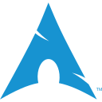

Linux-distributies worden algemeen aanbevolen voor privacybescherming en softwarevrijheid. Als je nog geen Linux gebruikt, zijn hieronder enkele distributies die we aanraden om uit te proberen, evenals enkele algemene tips om je privacy en veiligheid te verbeteren die op veel Linux-distributies van toepassing zijn.

- [Algemeen Linux-overzicht :material-arrow-right-drop-circle:](os/linux-overview.md)

## Traditionele verdelingen

### Fedora Werkstation

!!! recommendation

    { align=right }
    
    **Fedora Workstation** is onze aanbevolen distributie voor mensen die nieuw zijn met Linux. Fedora adopteert over het algemeen nieuwere technologieën dan andere distributies, b.v. [Wayland](https://wayland.freedesktop.org/), [PipeWire](https://pipewire.org), en binnenkort. Deze nieuwe technologieën gaan vaak gepaard met verbeteringen op het gebied van veiligheid, privacy en bruikbaarheid in het algemeen.
    
    [:octicons-home-16: Homepage](https://getfedora.org/){ .md-button .md-button--primary }
    [:octicons-info-16:](https://docs.fedoraproject.org/en-US/docs/){ .card-link title=Documentatie}
    [:octicons-heart-16:](https://whatcanidoforfedora.org/){ .card-link title=Bijdragen}

Fedora heeft een semi-rollende release cyclus. Terwijl sommige pakketten zoals [GNOME](https://www.gnome.org) bevroren worden tot de volgende Fedora uitgave, worden de meeste pakketten (inclusief de kernel) regelmatig bijgewerkt gedurende de levensduur van de uitgave. Elke Fedora release wordt een jaar lang ondersteund, met elke 6 maanden een nieuwe versie.

### openSUSE Tumbleweed

!!! recommendation

    { align=right }
    
    **openSUSE Tumbleweed** is een stabiele distributie met rollende release.
    
    openSUSE Tumbleweed heeft een [transactionele update](https://kubic.opensuse.org/blog/2018-04-04-transactionalupdates/) systeem dat gebruik maakt van [Btrfs](https://en.wikipedia.org/wiki/Btrfs) en [Snapper](https://en.opensuse.org/openSUSE:Snapper_Tutorial) om ervoor te zorgen dat snapshots kunnen worden teruggerold mocht er een probleem zijn.
    
    [:octicons-home-16: Homepage](https://get.opensuse.org/tumbleweed/){ .md-button .md-button--primary }
    [:octicons-info-16:](https://doc.opensuse.org/){ .card-link title=Documentatie}
    [:octicons-heart-16:](https://shop.opensuse.org/){ .card-link title=Bijdragen}

Tumbleweed volgt een rollend release-model waarbij elke update wordt vrijgegeven als een momentopname van de distributie. Wanneer je jouw systeem upgrade, wordt een nieuwe momentopname gedownload. Elke momentopname wordt door [openQA](https://openqa.opensuse.org) aan een reeks geautomatiseerde tests onderworpen om de kwaliteit ervan te verzekeren.

### Arch Linux

!!! recommendation

    { align=right }
    
    **Arch Linux** is een lichtgewicht, doe-het-zelf (DIY) distributie, wat betekent dat u alleen krijgt wat u installeert. Zie voor meer informatie hun [FAQ](https://wiki.archlinux.org/title/Frequently_asked_questions).
    
    [:octicons-home-16: Homepage](https://archlinux.org/){ .md-button .md-button--primary }
    [:octicons-info-16:](https://wiki.archlinux.org/){ .card-link title=Documentatie}
    [:octicons-heart-16:](https://archlinux.org/donate/){ .card-link title=Bijdragen}

Arch Linux heeft een doorlopende uitgavecyclus. Er is geen vast releaseschema en pakketten worden zeer frequent bijgewerkt.

Omdat het een doe-het-zelf distributie is, wordt van je verwacht [dat je jouw systeem zelf opzet en onderhoudt](#arch-based-distributions). Arch heeft een [officiële installer](https://wiki.archlinux.org/title/Archinstall) om het installatieproces wat gemakkelijker te maken.

Een groot deel van [Arch Linux's pakketten](https://reproducible.archlinux.org) zijn [reproduceerbaar](https://reproducible-builds.org).

## Immutable distributies

### Fedora Silverblue

!!! recommendation

    { align=right }
    
    **Fedora Silverblue** en **Fedora Kinoite** zijn immutable varianten van Fedora met een sterke focus op container workflows. Silverblue wordt geleverd met de [GNOME](https://www.gnome.org/) desktop omgeving terwijl Kinoite wordt geleverd met [KDE](https://kde.org/). Silverblue en Kinoite volgen hetzelfde release schema als Fedora Workstation, profiteren van dezelfde snelle updates en blijven zeer dicht bij de upstream.
    
    [:octicons-home-16: Homepage](https://silverblue.fedoraproject.org/){ .md-button .md-button--primary }
    [:octicons-info-16:](https://docs.fedoraproject.org/en-US/fedora-silverblue/){ .card-link title=Documentatie}
    [:octicons-heart-16:](https://whatcanidoforfedora.org/){ .card-link title=Bijdragen}

Silverblue (en Kinoite) verschillen van Fedora Workstation doordat ze de [DNF](https://fedoraproject.org/wiki/DNF) pakketbeheerder vervangen door een veel geavanceerder alternatief genaamd [`rpm-ostree`](https://docs.fedoraproject.org/en-US/fedora/rawhide/system-administrators-guide/package-management/rpm-ostree/). De `rpm-ostree` pakketbeheerder werkt door een basis image voor het systeem te downloaden, en er dan pakketten overheen te leggen in een [git](https://en.wikipedia.org/wiki/Git)-achtige commit tree. Wanneer het systeem wordt bijgewerkt, wordt een nieuw basisbeeld gedownload en worden de overlays op dat nieuwe beeld toegepast.

Nadat de update is voltooid, start je het systeem opnieuw op in de nieuwe versie. `rpm-ostree` houdt twee versies van het systeem bij, zodat je gemakkelijk kunt terugdraaien als er iets kapot gaat in de nieuwe versie. Er is ook de mogelijkheid om meer versies vast te pinnen als dat nodig is.

[Flatpak](https://www.flatpak.org) is de primaire pakketinstallatiemethode op deze distributies, aangezien `rpm-ostree` alleen bedoeld is om pakketten die niet in een container kunnen blijven bovenop de basisafbeelding te plaatsen.

Als alternatief voor Flatpaks is er de optie [Toolbox](https://docs.fedoraproject.org/en-US/fedora-silverblue/toolbox/) om [Podman](https://podman.io) containers te maken met een gedeelde home directory met het gast-besturingssysteem en een traditionele Fedora omgeving na te bootsen, wat een [nuttige eigenschap is](https://containertoolbx.org) voor de veeleisende ontwikkelaar.

### NixOS

!!! recommendation

    { align=right }
    
    NixOS is een onafhankelijke distributie gebaseerd op de Nix pakketbeheerder met een focus op reproduceerbaarheid en betrouwbaarheid.
    
    [:octicons-home-16: Homepage](https://nixos.org/){ .md-button .md-button--primary }
    [:octicons-info-16:](https://nixos.org/learn.html){ .card-link title=Documentatie}
    [:octicons-heart-16:](https://nixos.org/donate.html){ .card-link title=Bijdragen}

De pakketbeheerder van NixOS bewaart elke versie van elk pakket in een andere map in de **Nix store**. Hierdoor kun je verschillende versies van hetzelfde pakket op jouw systeem geïnstalleerd hebben. Nadat de inhoud van het pakket naar de map is geschreven, wordt de map alleen-lezen gemaakt.

NixOS biedt ook atomaire updates; het downloadt (of bouwt) eerst de pakketten en bestanden voor de nieuwe systeemgeneratie en schakelt daar dan naar over. Er zijn verschillende manieren om over te schakelen naar een nieuwe generatie; je kunt NixOS vertellen deze te activeren na reboot of je kunt er tijdens runtime naar overschakelen. Je kunt ook *testen* de nieuwe generatie door er tijdens runtime naar over te schakelen, maar het niet in te stellen als de huidige systeemgeneratie. Als iets in het updateproces stuk gaat, kunt je gewoon opnieuw opstarten en automatisch terugkeren naar een werkende versie van jouw systeem.

Nix de pakketbeheerder gebruikt een zuiver functionele taal - die ook Nix wordt genoemd - om pakketten te definiëren.

[Nixpkgs](https://github.com/nixos/nixpkgs) (de belangrijkste bron van pakketten) zijn opgenomen in een enkele GitHub repository. Je kan ook je eigen packages definiëren in dezelfde taal en ze dan gemakkelijk opnemen in je config.

Nix is een source-based package manager; als er geen pre-built beschikbaar is in de binaire cache, zal Nix het pakket gewoon vanaf de broncode bouwen met behulp van zijn definitie. Het bouwt elk pakket in een sandboxed *pure* omgeving, die zo onafhankelijk mogelijk is van het hostsysteem, waardoor binaries reproduceerbaar zijn.

## Op anonimiteit gerichte distributies

### Whonix

!!! recommendation

    { align=right }
    
    **Whonix** is gebaseerd op [Kicksecure](https://www.whonix.org/wiki/Kicksecure), een op beveiliging gerichte vork van Debian. Het is gefocust op privacy, veiligheid en anonimiteit op het internet te bieden. Whonix wordt het best gebruikt in combinatie met [Qubes OS](#qubes-os).
    
    [:octicons-home-16: Homepage](https://www.whonix.org/){ .md-button .md-button--primary }
    [:simple-torbrowser:](http://www.dds6qkxpwdeubwucdiaord2xgbbeyds25rbsgr73tbfpqpt4a6vjwsyd.onion){ .card-link title="Onion Service" }
    [:octicons-info-16:](https://www.whonix.org/wiki/Documentation){ .card-link title=Documentatie}
    [:octicons-heart-16:](https://www.whonix.org/wiki/Donate){ .card-link title=Dragen bij }

Whonix is bedoeld om te draaien als twee virtuele machines: een "Workstation" en een Tor "Gateway" Alle communicatie van het werkstation moet via de Tor-gateway gaan. Dit betekent dat zelfs als het werkstation wordt gecompromitteerd door malware, het ware IP-adres verborgen blijft.

Enkele van de functies zijn Tor Stream Isolation, [keystroke anonymization](https://www.whonix.org/wiki/Keystroke_Deanonymization#Kloak), [encrypted swap](https://github.com/Whonix/swap-file-creator), en een hardened memory allocator.

Toekomstige versies van Whonix zullen waarschijnlijk [full system AppArmor policies](https://github.com/Whonix/apparmor-profile-everything) en een [sandbox app launcher](https://www.whonix.org/wiki/Sandbox-app-launcher) bevatten om alle processen op het systeem volledig in te perken.

Whonix wordt het best gebruikt [in combinatie met Qubes](https://www.whonix.org/wiki/Qubes/Why_use_Qubes_over_other_Virtualizers), Qubes-Whonix heeft diverse [nadelen](https://forums.whonix.org/t/qubes-whonix-security-disadvantages-help-wanted/8581) in vergelijking met andere hypervisors.

### Tails

!!! recommendation

    { align=right }
    
    **Tails** is een live besturingssysteem gebaseerd op Debian dat alle communicatie via Tor laat lopen. Hij kan op bijna elke computer opstarten vanaf een DVD, USB-stick of SD-kaart.
    
    Het is bedoeld om de privacy en anonimiteit te bewaren, censuur te omzeilen en geen sporen achter te laten op de computer waarop het wordt gebruikt.

Het is de bedoeling dat Tails zichzelf reset na elke reboot. Versleutelde [persistente opslag](https://tails. boum. org/doc/first_steps/persistence/index. en. html) kan worden geconfigureerd om bepaalde gegevens op te slaan. Een Tails-systeem dat door malware is aangetast, kan de transparante proxy omzeilen, waardoor de gebruiker kan worden gedeanonimiseerd.

Tails bevat standaard [uBlock Origin](desktop-browsers.md#ublock-origin) in Tor Browser, wat het voor tegenstanders mogelijk gemakkelijker maakt om Tails-gebruikers te identificeren. [Whonix](desktop.md#whonix) virtuele machines zijn misschien lekbestendiger, maar ze zijn niet amnesisch, wat betekent dat gegevens kunnen worden teruggehaald van jouw opslagapparaat.

Het is de bedoeling dat Tails zichzelf volledig reset na elke herstart. Een versleutelde [persistente opslag](https://tails.boum.org/doc/persistent_storage/index.en.html) kan worden geconfigureerd om bepaalde gegevens tussen reboots op te slaan.

## Op veiligheid gerichte distributies

### Qubes OS

!!! recommendation

    { align=right }
    
    **Qubes OS** is een open-source besturingssysteem ontworpen om sterke beveiliging te bieden voor desktop computergebruik. Qubes is gebaseerd op Xen, het X Window System, en Linux, en kan de meeste Linux-toepassingen draaien en de meeste Linux-stuurprogramma's gebruiken.
    
    [:octicons-home-16: Homepage](https://www.qubes-os.org/){ .md-button .md-button--primary }
    [:material-arrow-right-drop-circle: Overview](os/qubes-overview.md){ .md-button .md-button--primary }
    [:simple-torbrowser:](http://qubesosfasa4zl44o4tws22di6kepyzfeqv3tg4e3ztknltfxqrymdad.onion){ .card-link title="Onion Service" } }
    [:octicons-eye-16:](https://www.qubes-os.org/privacy/){ .card-link title="Privacy Policy" }.
    [:octicons-info-16:](https://www.qubes-os.org/doc/){ .card-link title=Documentatie }.
    [:octicons-code-16:](https://github.com/QubesOS/){ .card-link title="Broncode" }.
    [:octicons-heart-16:](https://www.qubes-os.org/donate/){ .card-link title=Bijdragen }

Qubes OS is een op Xen gebaseerd besturingssysteem dat bedoeld is om sterke beveiliging te bieden voor desktopcomputers via beveiligde virtuele machines (VM's), ook bekend als *Qubes*.

Het besturingssysteem Qubes beveiligt de computer door subsystemen (bijv. netwerken, USB, enz.) en applicaties in afzonderlijke VM 's te isoleren. Als een deel van het systeem wordt gecompromitteerd, zal de extra isolatie waarschijnlijk de rest van het systeem beschermen. Zie voor meer details de Qubes [FAQ](https://www.qubes-os.org/faq/).

## Criteria

**Wij zijn niet verbonden aan de projecten die wij aanbevelen.** Naast [onze standaardcriteria](about/criteria.md)hebben wij een duidelijke reeks eisen ontwikkeld om objectieve aanbevelingen te kunnen doen. Wij stellen voor dat je zich vertrouwd maakt met deze lijst voordat je een project kiest, en jouw eigen onderzoek uitvoert om er zeker van te zijn dat het de juiste keuze voor je is.

!!! example "Deze sectie is nieuw"

    We werken aan het vaststellen van gedefinieerde criteria voor elk deel van onze site, en dit kan onderhevig zijn aan verandering. Als u vragen hebt over onze criteria, stel ze dan [op ons forum](https://discuss.privacyguides.net/latest) en neem niet aan dat we iets niet in overweging hebben genomen bij het opstellen van onze aanbevelingen als het hier niet vermeld staat. Er zijn veel factoren die worden overwogen en besproken wanneer wij een project aanbevelen, en het documenteren van elke factor is een werk in uitvoering.

Onze aanbevolen besturingssystemen:

- Moet open-source zijn.
- Moet regelmatig software en Linux kernel updates ontvangen.
- Linux-distributies moeten [Wayland](os/linux-overview.md#Wayland) ondersteunen.
- Moet tijdens de installatie volledige schijfversleuteling ondersteunen.
- Mag regelmatige releases niet langer dan 1 jaar bevriezen. Wij [raden](os/linux-overview.md#release-cycle) "Long Term Support" of "stabiele" distro-uitgaven niet aan voor desktopgebruik.
- Moet een grote verscheidenheid aan hardware ondersteunen.
